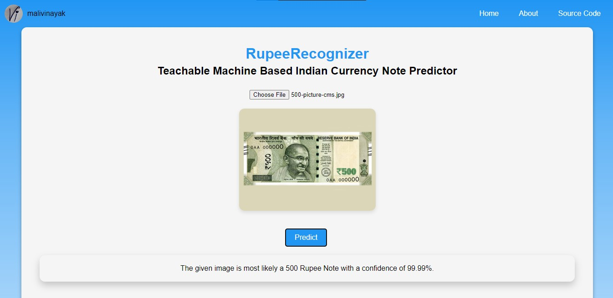

# RupeeRecognizer

RupeeRecognizer is a web application that utilizes the Teachable Machine platform to predict various denominations of Indian currency notes through machine learning. It allows users to upload images of Indian currency notes and predicts their denominations.



## Table of Contents

- [Introduction](#introduction)
- [Features](#features)
- [Installation](#installation)
- [Usage](#usage)
- [Contributing](#contributing)
- [Deployment](#deployment)
- [License](#license)

## Introduction

This project harnesses the power of machine learning to accurately identify various denominations of Indian currency notes. It is built using TensorFlow.js and the Teachable Machine platform, allowing for easy integration and deployment in web applications.

## Features

- Predicts denominations of Indian currency notes including 10, 20, 50, 100, 200, and 500 Rs notes.
- Utilizes a trained model based on a dataset comprising over 450 images of each note denomination.
- Provides real-time predictions with confidence levels.

## Installation

1. Clone the repository:

    ```bash
    git clone https://github.com/malivinayak/RupeeRecognizer.git
    ```

2. Navigate to the project directory:

    ```bash
    cd RupeeRecognizer
    ```

3. Open the `index.html` file in a web browser or deploy the project to a web server.

## Usage

1. Open the web application in a browser.
2. Click on the "Choose File" button to upload an image containing an Indian currency note.
3. Click the "Predict" button to view the predicted denomination of the uploaded note.
4. The prediction result will be displayed along with the confidence level.

## Contributing

Contributions are welcome! Please feel free to fork the repository, make changes, and submit pull requests. For major changes, please open an issue first to discuss the proposed changes.

## Deployment

The project can be deployed using GitHub Pages. You can access the live demo [here](https://malivinayak.github.io/RupeeRecognizer).

## License

This project is licensed under the MIT License - see the [LICENSE](LICENSE) file for details.
